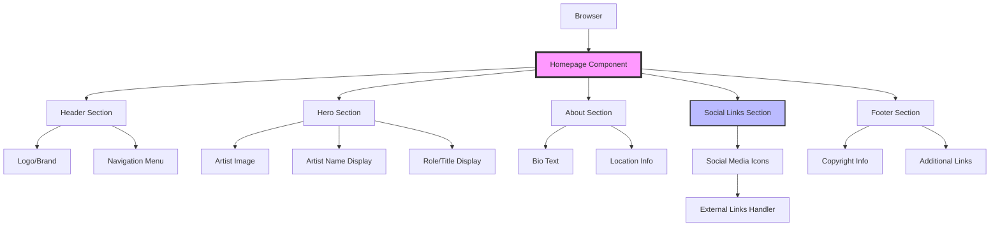
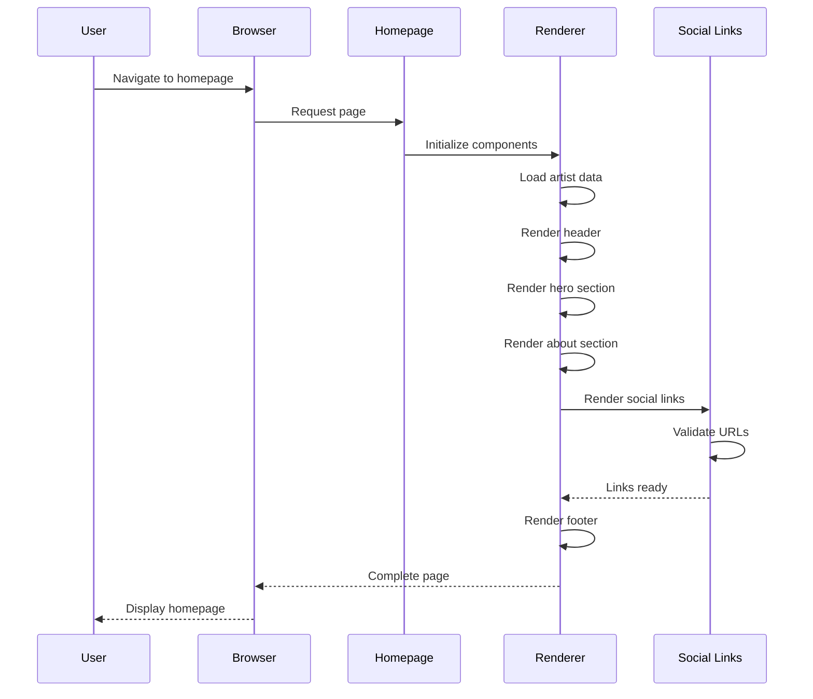
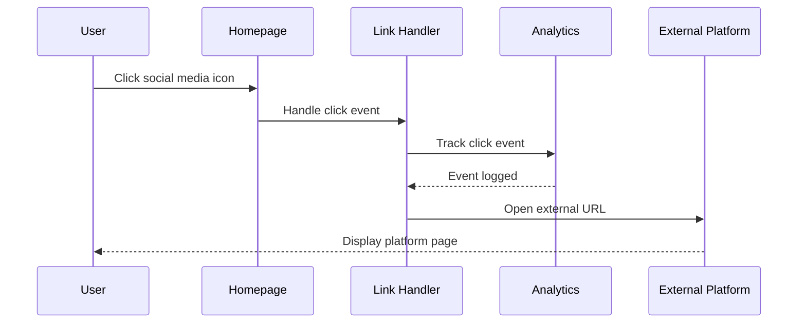

# Design Document: Artist Homepage

## Overview

The artist homepage is a single-page web application showcasing ARA AFRICA, a South African rapper, singer, and producer. The homepage serves as a digital portfolio and social media hub, providing visitors with artist information, visual branding, and direct links to all social media platforms. The design prioritizes visual impact, mobile responsiveness, and seamless navigation to external platforms, creating an engaging entry point for fans and industry professionals to connect with the artist's work across multiple channels.

## Architecture



## Sequence Diagrams

### Page Load Flow



### Social Link Click Flow



## Components and Interfaces

### Component 1: Homepage Container

**Purpose**: Main container component that orchestrates all sections and manages global state

**Interface**:
```pascal
INTERFACE HomepageContainer
  PROCEDURE initialize()
  PROCEDURE render(): HTMLElement
  PROCEDURE handleResize(event: ResizeEvent): void
  FUNCTION getArtistData(): ArtistData
END INTERFACE
```

**Responsibilities**:
- Initialize and coordinate all child components
- Manage responsive layout adjustments
- Provide artist data to child components
- Handle global event listeners

### Component 2: Header Section

**Purpose**: Top navigation and branding area

**Interface**:
```pascal
INTERFACE HeaderSection
  PROCEDURE render(): HTMLElement
  PROCEDURE toggleMobileMenu(): void
  FUNCTION isMenuOpen(): Boolean
END INTERFACE
```

**Responsibilities**:
- Display artist logo/brand
- Provide navigation menu (if applicable)
- Handle mobile menu toggle
- Maintain sticky/fixed positioning

### Component 3: Hero Section

**Purpose**: Primary visual impact area featuring artist image and name

**Interface**:
```pascal
INTERFACE HeroSection
  PROCEDURE render(artistData: ArtistData): HTMLElement
  PROCEDURE animateEntrance(): void
  FUNCTION loadImage(imageUrl: String): Promise
END INTERFACE
```

**Responsibilities**:
- Display prominent artist image
- Show artist name with visual emphasis
- Display role/title information
- Implement entrance animations
- Handle image loading states

### Component 4: About Section

**Purpose**: Artist biography and location information

**Interface**:
```pascal
INTERFACE AboutSection
  PROCEDURE render(artistData: ArtistData): HTMLElement
  FUNCTION formatLocation(location: String): String
END INTERFACE
```

**Responsibilities**:
- Display artist biography
- Show location information
- Format text content for readability

### Component 5: Social Links Section

**Purpose**: Display and manage social media platform links

**Interface**:
```pascal
INTERFACE SocialLinksSection
  PROCEDURE render(socialLinks: Array<SocialLink>): HTMLElement
  PROCEDURE handleLinkClick(platform: String, url: String): void
  FUNCTION validateUrl(url: String): Boolean
  FUNCTION getIconForPlatform(platform: String): IconElement
END INTERFACE
```

**Responsibilities**:
- Render social media icons with links
- Validate URLs before rendering
- Handle click events and analytics
- Provide visual feedback on hover/click
- Support keyboard navigation

### Component 6: Footer Section

**Purpose**: Bottom section with copyright and additional information

**Interface**:
```pascal
INTERFACE FooterSection
  PROCEDURE render(): HTMLElement
  FUNCTION getCurrentYear(): Integer
END INTERFACE
```

**Responsibilities**:
- Display copyright information
- Show additional links if needed
- Maintain consistent styling

## Data Models

### Model 1: ArtistData

```pascal
STRUCTURE ArtistData
  name: String
  role: String
  location: String
  bio: String
  imageUrl: String
  socialLinks: Array<SocialLink>
END STRUCTURE
```

**Validation Rules**:
- name must be non-empty string
- role must be non-empty string
- location must be non-empty string
- bio can be empty or contain formatted text
- imageUrl must be valid URL or relative path
- socialLinks must be non-empty array

### Model 2: SocialLink

```pascal
STRUCTURE SocialLink
  platform: String
  url: String
  displayName: String
  iconName: String
END STRUCTURE
```

**Validation Rules**:
- platform must be one of: ["soundcloud", "facebook", "instagram", "tiktok", "twitter", "youtube"]
- url must be valid URL starting with http:// or https://
- displayName must be non-empty string
- iconName must correspond to available icon set

### Model 3: ViewportState

```pascal
STRUCTURE ViewportState
  width: Integer
  height: Integer
  isMobile: Boolean
  isTablet: Boolean
  isDesktop: Boolean
END STRUCTURE
```

**Validation Rules**:
- width must be positive integer
- height must be positive integer
- Exactly one of isMobile, isTablet, isDesktop must be true

## Algorithmic Pseudocode

### Main Initialization Algorithm

```pascal
ALGORITHM initializeHomepage()
INPUT: None
OUTPUT: Rendered homepage

BEGIN
  // Step 1: Load artist data
  artistData ← loadArtistData()
  ASSERT artistData IS NOT NULL
  ASSERT validateArtistData(artistData) = TRUE
  
  // Step 2: Initialize viewport state
  viewportState ← detectViewport()
  ASSERT viewportState.width > 0 AND viewportState.height > 0
  
  // Step 3: Create and render components
  homepage ← createHomepageContainer()
  header ← createHeaderSection()
  hero ← createHeroSection(artistData)
  about ← createAboutSection(artistData)
  socialLinks ← createSocialLinksSection(artistData.socialLinks)
  footer ← createFooterSection()
  
  // Step 4: Assemble page structure
  homepage.append(header)
  homepage.append(hero)
  homepage.append(about)
  homepage.append(socialLinks)
  homepage.append(footer)
  
  // Step 5: Attach event listeners
  attachResizeListener(viewportState)
  attachScrollListeners()
  
  // Step 6: Render to DOM
  document.body.append(homepage)
  
  // Step 7: Trigger entrance animations
  hero.animateEntrance()
  
  ASSERT document.body.contains(homepage) = TRUE
  
  RETURN homepage
END
```

**Preconditions**:
- DOM is fully loaded
- Artist data is available
- Required CSS and assets are loaded

**Postconditions**:
- Homepage is rendered in DOM
- All components are initialized
- Event listeners are attached
- Entrance animations are triggered

**Loop Invariants**: N/A (no loops in main algorithm)

### Social Links Rendering Algorithm

```pascal
ALGORITHM renderSocialLinks(socialLinks)
INPUT: socialLinks of type Array<SocialLink>
OUTPUT: container of type HTMLElement

BEGIN
  ASSERT socialLinks IS NOT NULL
  ASSERT socialLinks.length > 0
  
  container ← createElement("div")
  container.className ← "social-links-container"
  
  // Process each social link with validation
  FOR each link IN socialLinks DO
    ASSERT validateUrl(link.url) = TRUE
    ASSERT link.platform IS NOT EMPTY
    
    linkElement ← createSocialLinkElement(link)
    container.append(linkElement)
  END FOR
  
  ASSERT container.children.length = socialLinks.length
  
  RETURN container
END
```

**Preconditions**:
- socialLinks is non-null array
- socialLinks contains at least one element
- Each link has valid platform and url properties

**Postconditions**:
- Returns HTMLElement container
- Container has exactly socialLinks.length children
- All URLs are validated
- All links are clickable and accessible

**Loop Invariants**:
- All previously processed links are valid and rendered
- Container.children.length equals number of processed links

### URL Validation Algorithm

```pascal
ALGORITHM validateUrl(url)
INPUT: url of type String
OUTPUT: isValid of type Boolean

BEGIN
  // Check basic structure
  IF url IS NULL OR url IS EMPTY THEN
    RETURN FALSE
  END IF
  
  // Check protocol
  IF NOT (url STARTS WITH "http://" OR url STARTS WITH "https://") THEN
    RETURN FALSE
  END IF
  
  // Check for valid domain structure
  urlPattern ← REGEX("^https?://[a-zA-Z0-9.-]+\\.[a-zA-Z]{2,}(/.*)?$")
  
  IF NOT urlPattern.matches(url) THEN
    RETURN FALSE
  END IF
  
  // All validations passed
  RETURN TRUE
END
```

**Preconditions**:
- url parameter is provided (may be null/empty)

**Postconditions**:
- Returns boolean indicating URL validity
- true if and only if URL has valid protocol and domain structure
- No side effects on input parameter

**Loop Invariants**: N/A (no loops)

### Responsive Layout Algorithm

```pascal
ALGORITHM updateResponsiveLayout(viewportState)
INPUT: viewportState of type ViewportState
OUTPUT: None (side effects: updates DOM classes)

BEGIN
  ASSERT viewportState IS NOT NULL
  ASSERT viewportState.width > 0
  
  body ← document.body
  
  // Remove all viewport classes
  body.classList.remove("mobile", "tablet", "desktop")
  
  // Apply appropriate class based on viewport
  IF viewportState.isMobile THEN
    body.classList.add("mobile")
    collapseMobileMenu()
  ELSE IF viewportState.isTablet THEN
    body.classList.add("tablet")
  ELSE IF viewportState.isDesktop THEN
    body.classList.add("desktop")
  END IF
  
  // Update component layouts
  updateHeaderLayout(viewportState)
  updateHeroLayout(viewportState)
  updateSocialLinksLayout(viewportState)
  
  ASSERT body.classList.contains("mobile") OR 
         body.classList.contains("tablet") OR 
         body.classList.contains("desktop") = TRUE
END
```

**Preconditions**:
- viewportState is valid and non-null
- DOM is fully loaded
- Body element exists

**Postconditions**:
- Exactly one viewport class is applied to body
- All components are updated for current viewport
- Mobile menu is collapsed if in mobile view

**Loop Invariants**: N/A (no loops)

## Key Functions with Formal Specifications

### Function 1: loadArtistData()

```pascal
FUNCTION loadArtistData(): ArtistData
```

**Preconditions**:
- None (function creates data from constants)

**Postconditions**:
- Returns valid ArtistData object
- All required fields are populated
- socialLinks array contains 6 elements
- All URLs are properly formatted

**Loop Invariants**: N/A

### Function 2: createSocialLinkElement()

```pascal
FUNCTION createSocialLinkElement(link: SocialLink): HTMLElement
```

**Preconditions**:
- link is non-null
- link.url is valid URL
- link.platform is recognized platform name
- link.iconName corresponds to available icon

**Postconditions**:
- Returns anchor element with proper attributes
- Element has href set to link.url
- Element has target="_blank" and rel="noopener noreferrer"
- Element contains icon and optional label
- Element has appropriate ARIA attributes for accessibility

**Loop Invariants**: N/A

### Function 3: detectViewport()

```pascal
FUNCTION detectViewport(): ViewportState
```

**Preconditions**:
- window object is available
- window.innerWidth and window.innerHeight are accessible

**Postconditions**:
- Returns ViewportState object
- width and height are positive integers
- Exactly one of isMobile, isTablet, isDesktop is true
- Breakpoints: mobile (<768px), tablet (768-1024px), desktop (>1024px)

**Loop Invariants**: N/A

### Function 4: handleLinkClick()

```pascal
PROCEDURE handleLinkClick(event: ClickEvent, platform: String, url: String)
```

**Preconditions**:
- event is valid click event
- platform is non-empty string
- url is valid URL

**Postconditions**:
- Click event is tracked (if analytics available)
- External link opens in new tab
- Original event default behavior is preserved
- No errors thrown

**Loop Invariants**: N/A

## Example Usage

### Example 1: Basic Page Initialization

```pascal
SEQUENCE
  // Wait for DOM to be ready
  WHEN document.ready THEN
    homepage ← initializeHomepage()
    DISPLAY "Homepage initialized successfully"
  END WHEN
END SEQUENCE
```

### Example 2: Creating Artist Data

```pascal
SEQUENCE
  artistData ← NEW ArtistData
  artistData.name ← "ARA AFRICA"
  artistData.role ← "Rapper, Singer, Producer"
  artistData.location ← "South Africa"
  artistData.bio ← "South African artist blending rap, singing, and production"
  artistData.imageUrl ← "/assets/ara-africa-hero.jpg"
  
  artistData.socialLinks ← [
    {platform: "soundcloud", url: "https://soundcloud.com/karabo-moalusi/albums", 
     displayName: "SoundCloud", iconName: "soundcloud"},
    {platform: "facebook", url: "https://facebook.com/KVLVNGA", 
     displayName: "Facebook", iconName: "facebook"},
    {platform: "instagram", url: "https://instagram.com/ara_wa_mo_africa", 
     displayName: "Instagram", iconName: "instagram"},
    {platform: "tiktok", url: "https://tiktok.com/@ara.africa", 
     displayName: "TikTok", iconName: "tiktok"},
    {platform: "twitter", url: "https://x.com/AraAfrika", 
     displayName: "Twitter", iconName: "twitter"},
    {platform: "youtube", url: "https://www.youtube.com/@araafrica0595", 
     displayName: "YouTube", iconName: "youtube"}
  ]
  
  IF validateArtistData(artistData) THEN
    DISPLAY "Artist data is valid"
  ELSE
    DISPLAY "Artist data validation failed"
  END IF
END SEQUENCE
```

### Example 3: Handling Social Link Click

```pascal
SEQUENCE
  link ← {platform: "instagram", url: "https://instagram.com/ara_wa_mo_africa"}
  
  WHEN user CLICKS socialLinkElement THEN
    event ← CAPTURE_EVENT()
    
    IF validateUrl(link.url) THEN
      handleLinkClick(event, link.platform, link.url)
      DISPLAY "Opening " + link.platform
    ELSE
      DISPLAY "Invalid URL for " + link.platform
      event.preventDefault()
    END IF
  END WHEN
END SEQUENCE
```

### Example 4: Responsive Layout Update

```pascal
SEQUENCE
  WHEN window RESIZES THEN
    newViewportState ← detectViewport()
    
    IF newViewportState.width < 768 THEN
      newViewportState.isMobile ← TRUE
      newViewportState.isTablet ← FALSE
      newViewportState.isDesktop ← FALSE
    ELSE IF newViewportState.width < 1024 THEN
      newViewportState.isMobile ← FALSE
      newViewportState.isTablet ← TRUE
      newViewportState.isDesktop ← FALSE
    ELSE
      newViewportState.isMobile ← FALSE
      newViewportState.isTablet ← FALSE
      newViewportState.isDesktop ← TRUE
    END IF
    
    updateResponsiveLayout(newViewportState)
  END WHEN
END SEQUENCE
```

## Correctness Properties

### Property 1: Artist Data Integrity

```pascal
PROPERTY ArtistDataIntegrity
  FORALL artistData IN ArtistData:
    artistData.name IS NOT EMPTY AND
    artistData.role IS NOT EMPTY AND
    artistData.location IS NOT EMPTY AND
    artistData.socialLinks.length >= 1 AND
    FORALL link IN artistData.socialLinks:
      validateUrl(link.url) = TRUE
END PROPERTY
```

### Property 2: Unique Social Platform Links

```pascal
PROPERTY UniqueSocialPlatforms
  FORALL artistData IN ArtistData:
    FORALL i, j IN [0..artistData.socialLinks.length):
      IF i ≠ j THEN
        artistData.socialLinks[i].platform ≠ artistData.socialLinks[j].platform
      END IF
END PROPERTY
```

### Property 3: Viewport State Consistency

```pascal
PROPERTY ViewportStateConsistency
  FORALL viewportState IN ViewportState:
    (viewportState.isMobile XOR viewportState.isTablet XOR viewportState.isDesktop) AND
    viewportState.width > 0 AND
    viewportState.height > 0 AND
    (viewportState.isMobile ⟹ viewportState.width < 768) AND
    (viewportState.isTablet ⟹ viewportState.width >= 768 AND viewportState.width < 1024) AND
    (viewportState.isDesktop ⟹ viewportState.width >= 1024)
END PROPERTY
```

### Property 4: Accessibility Compliance

```pascal
PROPERTY AccessibilityCompliance
  FORALL linkElement IN SocialLinkElements:
    linkElement.hasAttribute("href") AND
    linkElement.hasAttribute("aria-label") AND
    linkElement.hasAttribute("rel") AND
    linkElement.getAttribute("rel") CONTAINS "noopener" AND
    linkElement.getAttribute("target") = "_blank"
END PROPERTY
```

### Property 5: Component Rendering Idempotence

```pascal
PROPERTY RenderingIdempotence
  FORALL component IN Components:
    FORALL data IN ComponentData:
      render(component, data) = render(component, data)
END PROPERTY
```

## Error Handling

### Error Scenario 1: Invalid Social Media URL

**Condition**: Social media URL fails validation (malformed, missing protocol, invalid domain)
**Response**: Log warning to console, skip rendering that specific link, continue with remaining links
**Recovery**: Display only valid social links; provide fallback message if all links are invalid

### Error Scenario 2: Image Loading Failure

**Condition**: Artist hero image fails to load (404, network error, timeout)
**Response**: Display placeholder image or gradient background with artist initials
**Recovery**: Retry image load after delay; fallback to default styling if persistent failure

### Error Scenario 3: Missing Artist Data

**Condition**: Artist data object is null, undefined, or missing required fields
**Response**: Use default/fallback data structure with placeholder values
**Recovery**: Log error for debugging; display minimal homepage with contact information

### Error Scenario 4: Viewport Detection Failure

**Condition**: window.innerWidth or window.innerHeight unavailable or return invalid values
**Response**: Default to desktop layout (width: 1024px, height: 768px)
**Recovery**: Retry detection on next resize event; use CSS media queries as fallback

### Error Scenario 5: Event Listener Attachment Failure

**Condition**: Unable to attach resize or scroll event listeners (browser compatibility, permissions)
**Response**: Log warning; rely on CSS-only responsive design
**Recovery**: Graceful degradation to static layout; core functionality remains intact

## Testing Strategy

### Unit Testing Approach

Test each component and function in isolation:

1. **Data Validation Tests**
   - Test validateUrl() with valid and invalid URLs
   - Test validateArtistData() with complete and incomplete data
   - Test edge cases: empty strings, null values, special characters

2. **Component Rendering Tests**
   - Test each component renders with valid data
   - Test components handle missing optional data gracefully
   - Verify correct HTML structure and CSS classes

3. **Viewport Detection Tests**
   - Test detectViewport() at various screen sizes
   - Verify correct breakpoint classification
   - Test edge cases at exact breakpoint values (768px, 1024px)

4. **Link Handling Tests**
   - Test createSocialLinkElement() creates proper anchor tags
   - Verify security attributes (rel="noopener noreferrer")
   - Test accessibility attributes (aria-label, role)

**Coverage Goal**: 90%+ code coverage for all functions and components

### Property-Based Testing Approach

Use property-based testing to verify invariants hold across random inputs:

**Property Test Library**: fast-check (for JavaScript/TypeScript)

1. **URL Validation Property**
   - Generate random strings and verify validateUrl() never crashes
   - Verify valid URLs always return true, invalid always return false
   - Test that validation is consistent (same input always gives same output)

2. **Artist Data Property**
   - Generate random ArtistData objects
   - Verify validateArtistData() correctly identifies valid/invalid data
   - Test that valid data always renders without errors

3. **Viewport State Property**
   - Generate random viewport dimensions
   - Verify exactly one of isMobile/isTablet/isDesktop is always true
   - Test that breakpoint logic is consistent and non-overlapping

4. **Rendering Idempotence Property**
   - Generate random component data
   - Verify rendering same data twice produces identical output
   - Test that render functions have no side effects

### Integration Testing Approach

Test component interactions and full page workflows:

1. **Full Page Load Test**
   - Test complete initialization sequence
   - Verify all components render in correct order
   - Check that event listeners are properly attached

2. **Responsive Behavior Test**
   - Simulate viewport resize events
   - Verify layout updates correctly at each breakpoint
   - Test mobile menu toggle functionality

3. **Social Link Navigation Test**
   - Simulate clicks on each social media link
   - Verify links open in new tabs
   - Test analytics tracking (if implemented)

4. **Accessibility Integration Test**
   - Test keyboard navigation through all interactive elements
   - Verify screen reader compatibility
   - Test focus management and ARIA attributes

## Performance Considerations

1. **Image Optimization**
   - Use responsive images with srcset for different screen sizes
   - Implement lazy loading for below-the-fold images
   - Compress images to WebP format with JPEG fallback
   - Target: Hero image loads in <1 second on 3G connection

2. **CSS and JavaScript Optimization**
   - Minify and bundle CSS/JS files
   - Use critical CSS inline for above-the-fold content
   - Defer non-critical JavaScript loading
   - Target: First Contentful Paint <1.5 seconds

3. **Caching Strategy**
   - Implement browser caching for static assets
   - Use service worker for offline functionality (optional)
   - Cache social media icons and fonts locally

4. **Animation Performance**
   - Use CSS transforms and opacity for animations (GPU-accelerated)
   - Avoid layout thrashing during scroll/resize events
   - Debounce resize event handlers (250ms delay)
   - Target: Maintain 60fps during animations

5. **Bundle Size**
   - Keep total page weight under 500KB (uncompressed)
   - Use tree-shaking to eliminate unused code
   - Consider code splitting if adding more features

## Security Considerations

1. **External Link Security**
   - All external links use rel="noopener noreferrer" to prevent tabnabbing
   - Validate all URLs before rendering to prevent XSS
   - Use Content Security Policy (CSP) headers to restrict resource loading

2. **Data Sanitization**
   - Sanitize any user-generated content (if added in future)
   - Escape HTML in artist bio and text fields
   - Validate all input data against expected schemas

3. **HTTPS Enforcement**
   - Serve entire site over HTTPS
   - Ensure all external links use HTTPS
   - Implement HSTS headers for secure connections

4. **Privacy Considerations**
   - Minimize analytics tracking (if implemented)
   - Comply with GDPR/privacy regulations
   - Provide clear privacy policy if collecting any data

5. **Dependency Security**
   - Regularly audit and update dependencies
   - Use Subresource Integrity (SRI) for CDN resources
   - Avoid including unnecessary third-party scripts

## Dependencies

### Core Dependencies

1. **HTML5** - Semantic markup structure
2. **CSS3** - Styling and responsive design
   - CSS Grid for layout
   - CSS Flexbox for component alignment
   - CSS Custom Properties for theming
   - CSS Animations for entrance effects

3. **JavaScript (ES6+)** - Interactivity and dynamic behavior
   - Native DOM APIs (no framework required for MVP)
   - Optional: Vanilla JS or lightweight library

### Optional Dependencies

1. **Icon Library** - Social media icons
   - Font Awesome (free tier)
   - OR Feather Icons
   - OR Custom SVG icons (recommended for performance)

2. **Animation Library** (optional)
   - GSAP for advanced animations
   - OR CSS-only animations (recommended for simplicity)

3. **Analytics** (optional)
   - Google Analytics
   - OR Plausible Analytics (privacy-focused)

### Development Dependencies

1. **Build Tools** (if using bundler)
   - Vite or Parcel for development server
   - PostCSS for CSS processing
   - Autoprefixer for browser compatibility

2. **Testing Tools**
   - Jest or Vitest for unit tests
   - fast-check for property-based tests
   - Playwright or Cypress for integration tests

3. **Code Quality**
   - ESLint for JavaScript linting
   - Prettier for code formatting
   - Stylelint for CSS linting

### External Services

1. **Social Media Platforms** - External links to:
   - SoundCloud
   - Facebook
   - Instagram
   - TikTok
   - Twitter/X
   - YouTube

2. **Hosting** (deployment target)
   - Static hosting (Netlify, Vercel, GitHub Pages)
   - CDN for asset delivery
   - Domain name service

### Browser Compatibility

- Modern browsers (Chrome, Firefox, Safari, Edge) - last 2 versions
- Mobile browsers (iOS Safari, Chrome Mobile) - last 2 versions
- Progressive enhancement for older browsers
- Graceful degradation for unsupported features
